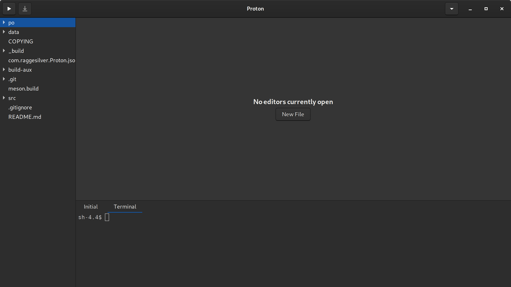

# Proton

Proton is a simple text editor, soon-to-be IDE.

## Compile / Install
Use `flatpak` or `meson` (ninja) to install or compile Proton.

## Features worth sharing
- Integrated terminal (doesn't work on flatpak yet)
- Editorconfig plugin

## Todos (sorted by importance)
1. Command palette
2. File popover + file operations
3. Preferences menu
4. Plugins: run, 42, git
5. Finish terminal widget
6. Finish `OpenWindow`[^1]
~~File modified characted on the window title (e.g "Proton - filename.c •")~~
~~Prevent app quiting when modified editors are still open~~
~~TreeView updates~~

---

[^1]: 
